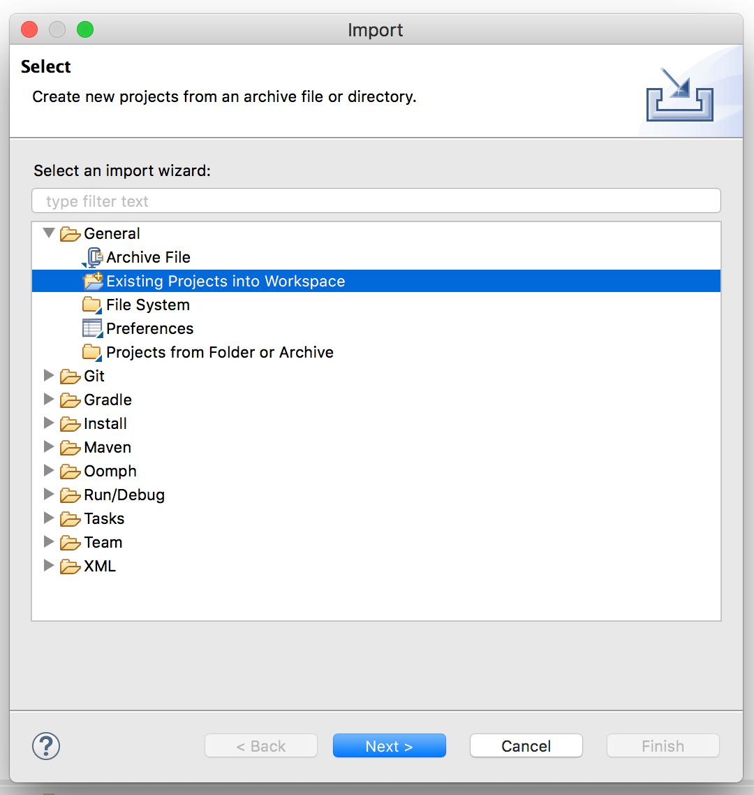
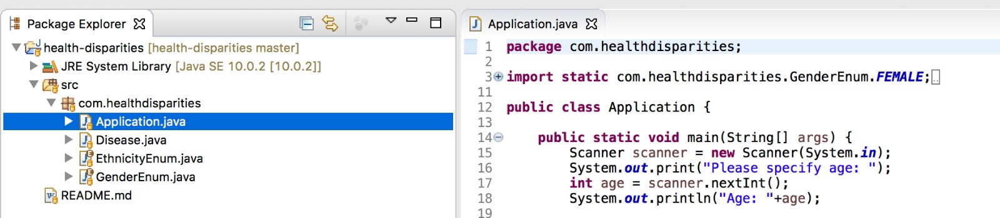

# Health Disparities

## Purpose

Health Disparities is an open source tool focused on describing racial disparities in health. To address the contribution of these factors on health disparities related to age, gender, and race/ethnicity is supported by data and statistics from the Centers for Disease Control and Prevention (CDC).

## How to run

### Prerequisites

- Java 1.8

- Eclipse

### How to run 

- Clone this repository
	```
	git clone https://github.com/loumonts/health-disparities.git
	```

- Open Eclipse

- Import the repository on Eclipse





- Open the file `Application` at `health-disparities/src/com/healthdisparities`




- Run the application

- Specify the data required (age, gender, ethnicity) and the program will inform you the results.