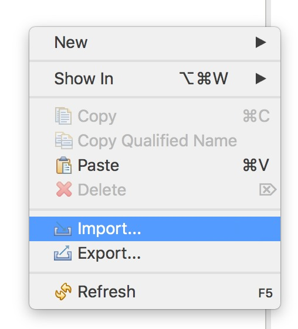

# Health Disparities

## Purpose

## How to run

### Prerequisites

- Java 1.8

- Eclipse

### How to run 

- Clone this repository
	```
	git clone https://github.com/loumonts/health-disparities.git
	```

- Open Eclipse

- Import the repository on Eclipse



- Open the file `Application` at `health-disparities/src/com/healthdisparities`

- Run the application

- Specify the data required (age, gender, ethnicity) and the program will inform you the results.